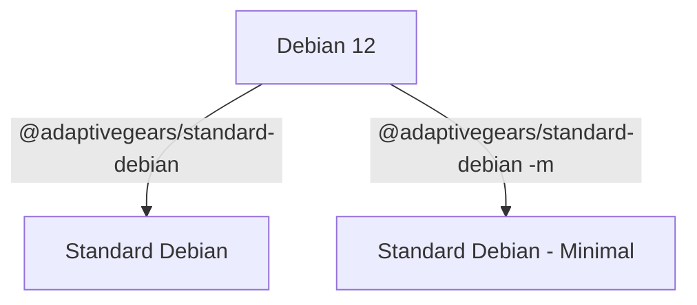

# ansible-collection-actions

```mermaid
flowchart TB
    Debian12[Debian 12]
    StandardDebian[Standard Debian]
    MinimalDebian[Standard Debian - Minimal]

    Debian12 -- @adaptivegears/standard-debian --> StandardDebian
    Debian12 -- @adaptivegears/standard-debian -m --> MinimalDebian
```

# reference

- https://portal.cloud.hashicorp.com/vagrant/discover/bento/debian-12
